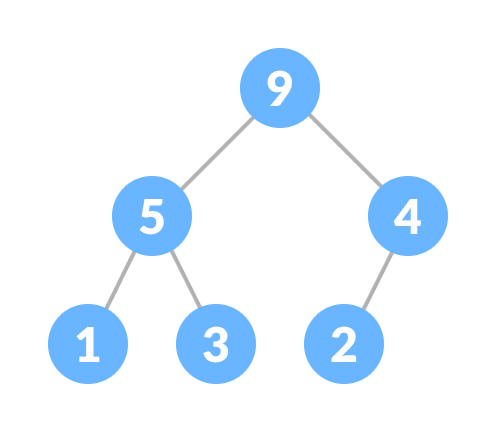

## Why Tree Structure?

**`O(log n)`**

## Binary Tree

A tree in which each node has at most two children (parent, left, and right)

## Full Binary Tree

A full binary tree (sometimes proper binary tree or 2-tree) is a tree in which every node other than the leaves has two children.


## Complete Binary Tree

A complete binary tree is a binary tree in which every level, except possibly the last, is completely filled, and all nodes are as far left as possible.


## Tree Representation

Storage choices:

1. array representation (contiguous list)
2. node representation.


- root = 0
- left_child i = `i*2 + 1`
- right_child i = `i*2 + 2`
- parent i = `(i - 1) / 2`

## Tree Traversals

- In-order: left child => parent => right child
- Pre-order: parent => left child => right child
- Post-order: left child => right child => parent

## Binary Search Tree (BST)

It is called a search tree because it can be used to search for the presence of a number in `O(log(n))` time.

- All nodes of left subtree are less than the root node
- All nodes of right subtree are more than the root node
- Both subtrees of each node are also BSTs i.e. they have the above two properties


```
# validate binary search tree
checkBST(root, min, max) bool:
  if root.data < mid or root.data > max:
    return false
  return checkBST(root.left, min, root.data) && checkBST(root.right, root.data+1, max)
```

Search

```
If root == NULL
    return NULL;
If number == root->data
    return root->data;
If number < root->data
    return search(root->left)
If number > root->data
    return search(root->right)
```

Insert

```
If node == NULL
    return createNode(data)
if (data < node->data)
    node->left  = insert(node->left, data);
else if (data > node->data)
    node->right = insert(node->right, data);
return node;
```

## Heap

A tree where parent node has bigger (smaller) value than children

Min-heaps make it easy to find the smallest element.Max-heaps make it easy to find the largest element.

- find min/max: `O(1)`
- delete min/max: `O(log n)`
- insert: `O(log n)`

### Max Heap

(for max heap) key of each node is always greater than its child node/s and the key of the root node is the largest among all other nodes;



### Min Heap

(for min heap) key of each node is always smaller than the child node/s and the key of the root node is the smallest among all other nodes.


### Complexity of Binary Search Trees

| Operation |  Average  | (Unbalanced)Worst | (Balanced)Worst |
| --------- | :-------: | :---------------: | :-------------: |
| Insert    | O(log(n)) |       O(n)        |    O(log(n))    |
| Delete    | O(log(n)) |       O(n)        |    O(log(n))    |
| Search    | O(log(n)) |       O(n)        |    O(log(n))    |

_if the binary search tree contains a list of increasing numbers => O(n)_

### AVL tree

An AVL tree is a self-balancing binary search tree, balaned to maintain `O(log n)` height.

A B-tree is a balanced tree, but it is not a binary tree. Nodes have more children, which increases per-node search time but decreases the number of nodes the search needs to visit.
